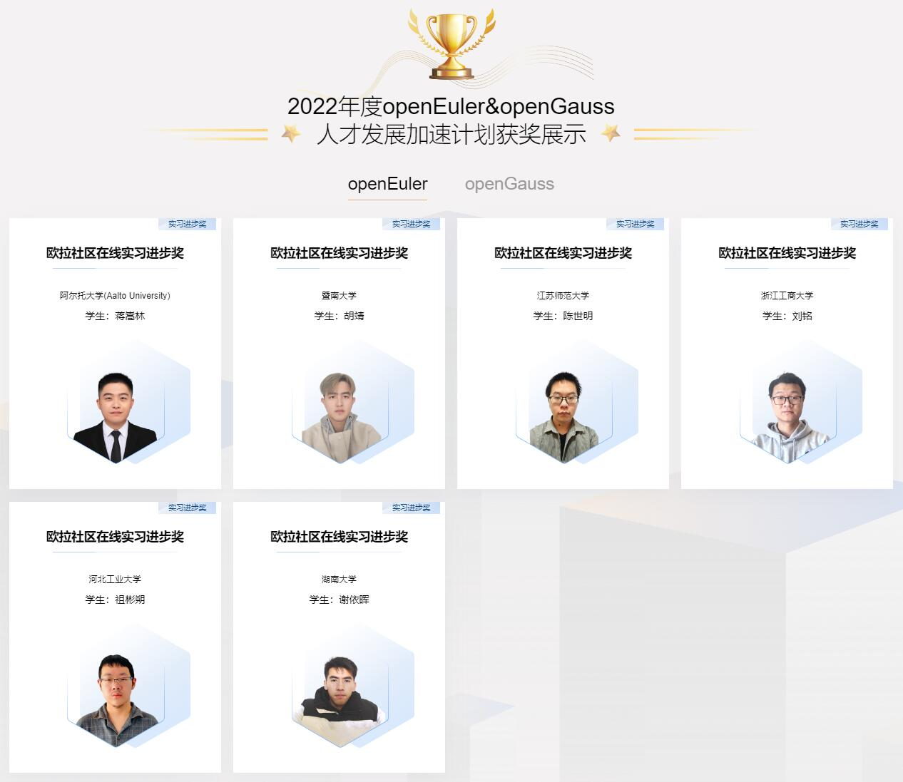

# 我的 openEuler 开源实习 / My openEuler Open Source Internship

这里是我的"openEuler 开源实习"活动记录与成果。

https://www.openeuler.org/zh/internship/

This is my work and record under openEuler Open Source Internship. (All the announcements are in Chinese)

| 任务 Task | Issue | PR | 分值 Credits |
| --- | --- | --- | --- |
| 适配 accountsservice 的 dbus 接口 | https://gitee.com/openeuler-competition/opensource-internship/issues/I4P81J | https://gitee.com/jiangsonglin2/kiran-cc-daemon/commit/b3251f66053c2dd7438ff34a0d9d93b485fea623 | 30 |
| 为 Rust 工具 mdbook 实现 PDF 格式输出功能 | https://gitee.com/openeuler/opensource-intern/issues/I4QM4V | https://gitee.com/openeuler/opensource-intern/pulls/9 https://gitee.com/openeuler/opensource-intern/pulls/11 https://gitee.com/openeuler/opensource-intern/pulls/12 https://gitee.com/openeuler/opensource-intern/pulls/14 | 50 |
| Cloud Native 云原生组件容器镜像镜像制作 coredns | https://gitee.com/openeuler/cloudnative/issues/I49Z2Y | https://gitee.com/openeuler/openeuler-docker-images/pulls/16 | 10 |
| sig QA procinfo 软件包加固测试 | https://gitee.com/src-openeuler/procinfo/issues/I4TZ8G | https://gitee.com/openeuler/mugen/pulls/277 | 10 |
|sig UKUI 图形化备份工具的引入 | https://gitee.com/openeuler-competition/opensource-internship/issues/I4R5WP | https://gitee.com/openeuler/community/pulls/3305 https://gitee.com/src-openeuler/backintime/pulls/1 https://gitee.com/openeuler/community/pulls/3329 | 20
| Cloud Native 云原生组件容器镜像镜像制作 calico | https://gitee.com/openeuler/cloudnative/issues/I49Z3A | https://gitee.com/openeuler/openeuler-docker-images/pulls/15 https://gitee.com/openeuler/community/pulls/3685 https://gitee.com/src-openeuler/calico/pulls/1 | 30 |

[重点成果（Awesome Achievement）: mdbook-pdf](https://github.com/HollowMan6/mdbook-pdf)

[mdbook-pdf 开发文档/Report](mdbook-pdf.pdf)

[总实习报告/Internship Report](开源实习报告.pdf)

[PPT/Slides](openEuler%E5%BC%80%E6%BA%90%E5%AE%9E%E4%B9%A0.pptx)

[演讲稿](%E5%88%86%E4%BA%AB%E4%BC%9A.md)

[开源实习优秀实习生答辩会直播视频](https://www.bilibili.com/video/BV1fe4y1o766)

[欧拉&高斯人才发展加速计划](https://edu.hicomputing.huawei.com/openeuler-opengauss-talent)

[openEuler & openGauss 人才发展加速计划2022年度奖项](https://edu.hicomputing.huawei.com/openeuler-opengauss-talent/award)
